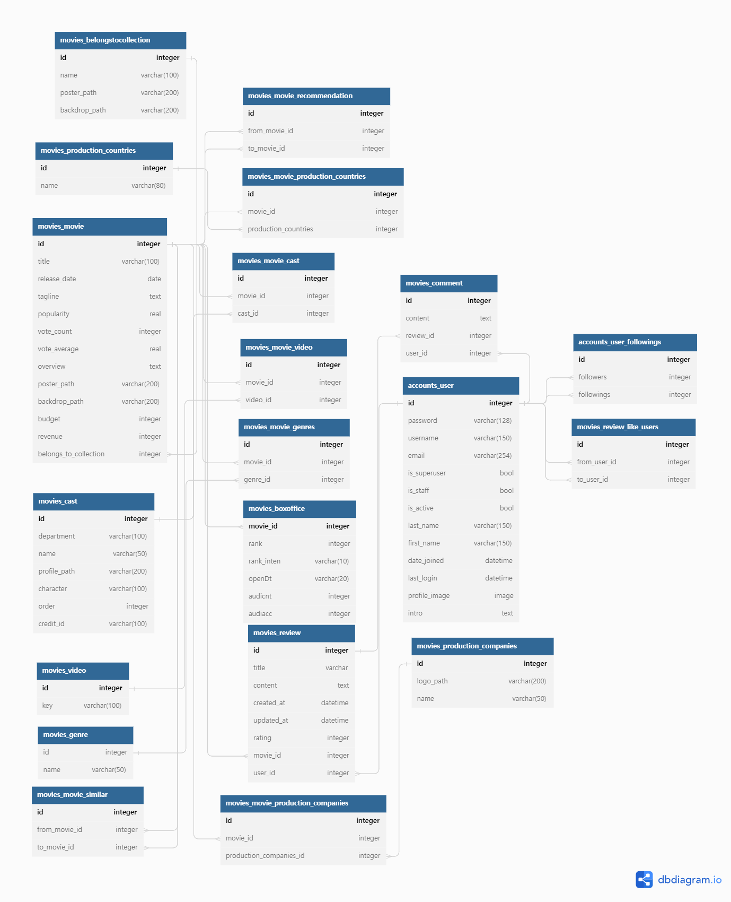
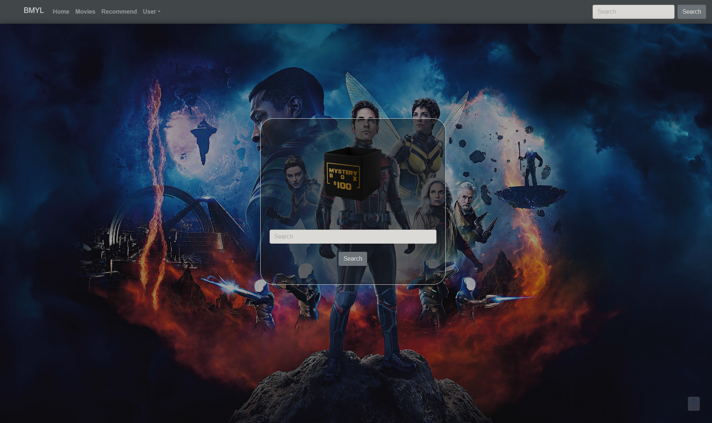
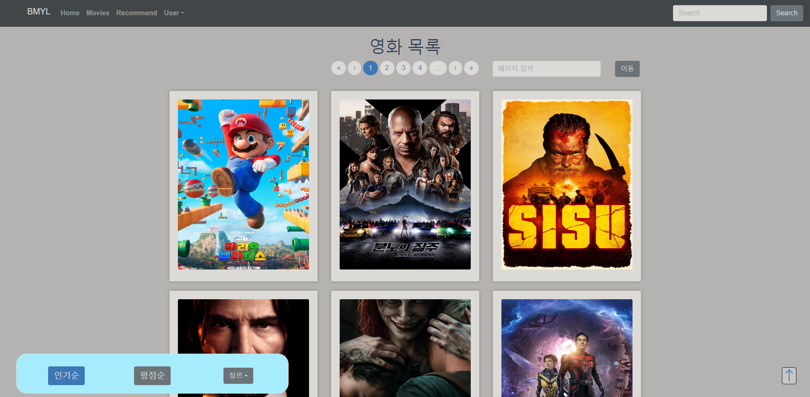
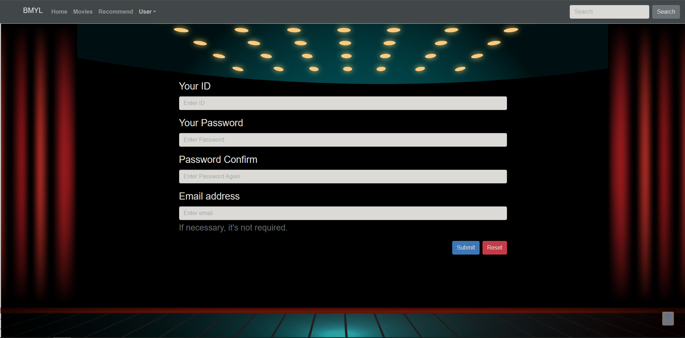
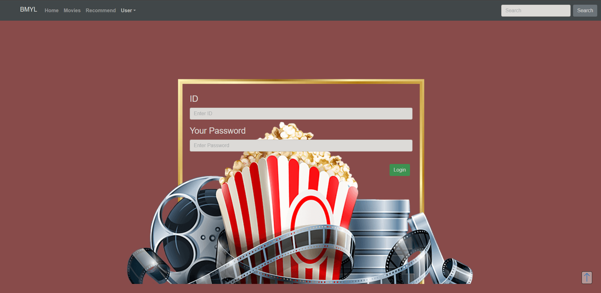
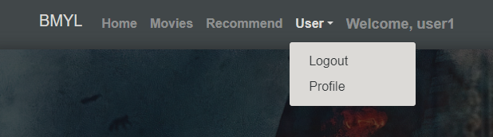
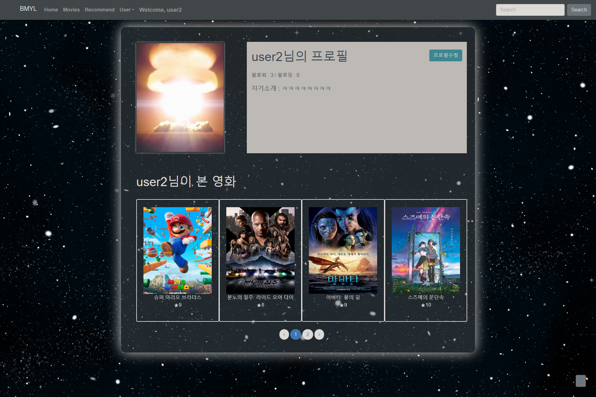
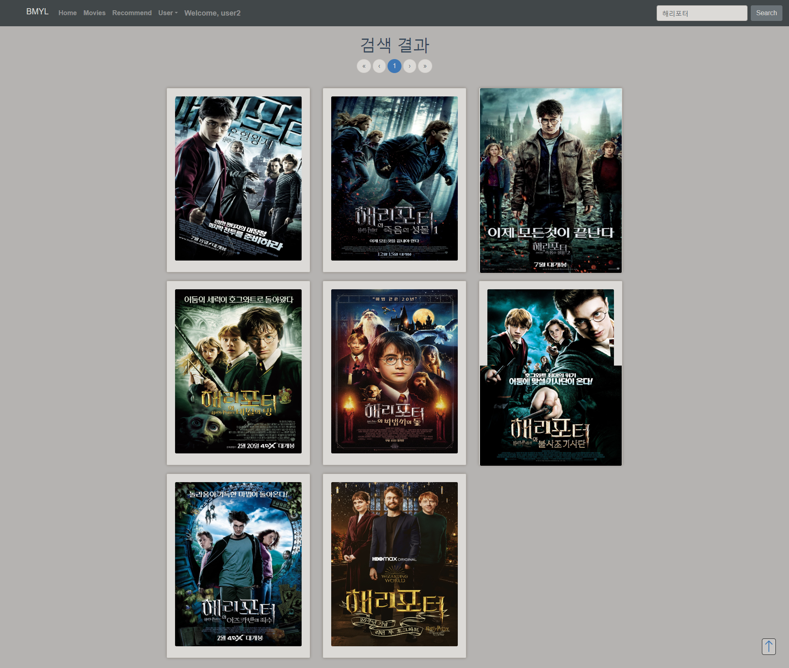
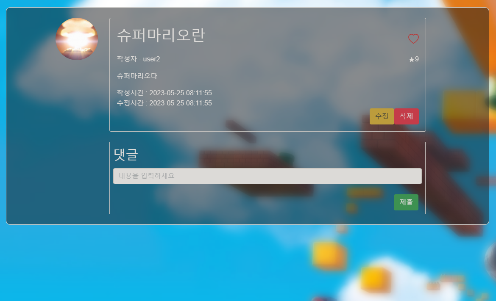
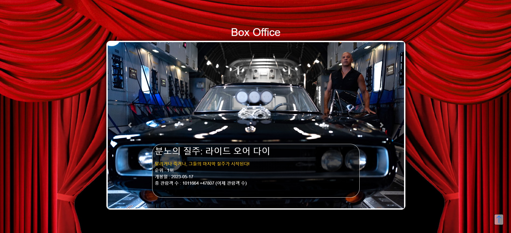

# BMYL
Best Movie in Your Life

# 1. 팀원 정보 및 업무 분담 내역

- 팀장 차영범 및 팀원 허준영 2명이 진행함.
- 각각 프론트 곧 홈페이지 작업 / 백엔드 API 작업을 맡았다.
- 차영범:
  - 프론트 UI, 기능 구현
  - 로그인 기능
  - 백엔드 디버깅 및 코드 효율화
  - 프론트 디자인 총괄
  - todo list 조직 및 일정 관리
  - 서버-클라이언트 테스트

- 허준영:
  - DB 설계 및 백엔드 작업
  - 프론트 초안 설계
  - 핵심 알고리즘 조직
  - 프로젝트 아이디어 제공


# 2. 목표 서비스 구현 및 실제 구현 정보

- 유저 친화형으로 제작.
- 영화를 즐겨보는 사람들이 영화관 또는 집에서 영화를 볼 때 최적의 환경에서 영화를 편하게 볼 수 있게 하기 위함.
- 추천 알고리즘에 영화관과 집을 선택할 수 있게 한다.
  - 영화관을 방문하고자 하는 유저는 현재 박스오피스 현황을 파악할 수 있는 정보를 얻을 수 있다.
  - 집에서 영화를 보려는 사람은 본인의 리뷰 활동을 바탕으로 추천 영화를 제공받는다.
- 여럿이서 영화를 함께 보려고 할 때 각각의 리뷰 활동을 통해 공통적으로 좋아할 만한 영화를 추천한다.

# 3. 데이터베이스 모델링(ERD)



- TMDB에서 가져온 영화 정보를 DB에 담아서 각각 다대다, 일대다 관계로 묶었다.

# 4. 영화 추천 알고리즘에 대한 기술적 설명

- 모든 유저마다 평점을 매기는 성향이 차이가 있으므로 평점의 절대값으로 추천 영화를 만드는 것은 부정확하다고 판단했다.
- 따라서 유저마다 영화에 매기는 평점을 정규화하여 상대적으로 낮은 점수를 매기는 사람에게도 좋아하는 영화를 추천받을 수 있게 했다.
- 정규화는 다음과 같이 진행했다.
``` 
 maximum = max
 minimum = min
 value = v
 if v > 5.5:
     5.5 + ((v - 5.5)*(10-5.5)/(max-5.5))
 else:
     5.5 - ((5.5 - v)*(5.5-1)/(5.5-min)
 if v > 5.5:
     point = 5.5 + (v-5.5)*4.5/(max-5.5)
 else:
     point = 5.5 - (5.5-v)*4.5/(5.5-min)

```
 - 여럿이서 영화를 보는 경우 각각 매긴 영화가 가지고 있는 추천 영화 목록 데이터에 각 유저의 정규화된 평점이 가중되어 포켓에 들어가고 만일 다른 유저가 같은 영화를 추천받는다면 얻은 점수에 다른 사람이 매긴 점수가 합산되고, 점수를 매기지 않았다면 해당 영화의 기본 평점이 합산된다.
 - 평균과 개인의 가중치를 이용해 여럿이서 함께 볼 수 있는 영화를 추천할 수 있게 조직했다.

 5. 서비스 대표 기능에 대한 설명

 1) 홈페이지



- 홈페이지에 들어오면 상단의 네비게이션 바, 그리고 정면에 영화 이미지와 검색창이 나타난다.
- 뒷 배경은 슬라이드 효과로 전체 영화 리스트 중에서 랜덤으로 나타나게 된다.
- 네비게이션 바에서 홈 / 영화목록 / 추천영화 / 사용자 회원가입 & 로그인 기능을 할 수 있다.
- 정면의 검색창 또는 네이게이션 바의 오른쪽 상단에서 영화 검색을 할 수 있다.

## 2) 영화목록페이지


- 인기, 평점, 장르별로 영화 목록을 조회할 수 있다. 
- 유저들의 활동에 따라 영화 목록이 지속해서 늘어나도록 되어 있다. 이는 유저 맞춤형으로 되어 사용자 맞춤의 취향이나 장르를 지속적으로 볼 수 있게 된다.
- 전체 목록을 보여주기 때문에 페이지를 누르거나 직접 페이지를 눌러서 이동할 수 있다.

## 3) 회원가입 및 로그인




- 기본적으로 유저간 커뮤니티를 위한 회원가입과 로그인 페이지이다.



- 로그인 한 상태라면 상단의 유저 메뉴 옆에 로그인 한 사람을 표시하고 유저 프로필에 들어갈 수 있다.

## 4) 유저 프로필 페이지



- 유저 프로필 페이지에서는 본인의 정보를 보고 꾸밀 수 있다.
- 자신이 보고 리뷰와 평점을 남긴 영화를 볼 수 있다.
- 프로필 수정을 눌러 프로필 사진과 자기소개를 바꿀 수 있다.

## 5) 영화 검색



- 키워드를 입력하면 해당 영화들을 페이지에 띄워준다.
- 영화 갯수가 많아지면 페이지 버튼을 눌러 조절할 수 있다.

## 6) 영화 상세 페이지


- 해당 영화의 정보와 구매 사이트, 그리고 유저간의 커뮤니티 기능을 이용할 수 있는 페이지다.
- 하단의 배우, 트레일러, 배급사로 영화의 정보를 더 확인할 수 있다.


- 하단 추천 탭에서 추천 영화와 비슷한 영화를 볼 수 있으며, 해당 포스터를 클릭하면 그 영화에 대한 상세 정보를 확인할 수 있다.

## 7) 영화 리뷰 페이지


- 이곳에서 해당 영화의 리뷰글을 쓸 수 있고, 다른 유저가 남긴 리뷰글을 볼 수도 있다.



- 리뷰글 좋아요와, 댓글 기능을 사용할 수 있다.
- 이때, 리뷰를 남긴 유저의 프로필 사진을 클릭하면 해당 유저의 프로필에 접근할 수 있다.

## 8) 영화 추천 페이지


- 네비게이션바의 recommend를 클릭하면 위의 페이지로 이동한다.
- 유저는 영화관이나 집 두 장소 중 영화를 볼 장소를 선택한다.

### (1) 영화관을 선택했을 경우



- 현재 영화관에서 상영중인 영화들을 슬라이드로 보여준다.
- 영화관 총 관객 수와 현재 영화 순위 등을 보여준다.
- 해당 글을 클릭하면 영화 상세페이지로 이동한다.

### (2) 집을 선택했을 경우


- 현재 내가 팔로잉하는 인원들 중에서 파티 인원을 선택할 수 있다.
- 선택하면 나와 파티로 연결된 인원들을 토대로 추천영화를 검색해준다.


# 6. 느낀점

차영범:
- 처음으로 서버와 클라이언트 분할하여 작업을 해보았는데,처음부터 하나씩 해결해가는 과정이 순탄치 않았다. 페이지를 구성하는 순간에도 수많은 버그와 오류를 맞이했고, 이를 해결하고자 인터넷에서 찾아가며 공부하는 시간이 더 많았던 것 같다.
- 위처럼 소위 삽질하는 시간이라 표현되어 시간이 많이 뺏기다보니 일정대로 하고자 하였으나 밀리는 경우가 많아서 프로젝트 준비나 진행에서는 철저하게 할 수 있는 일과 없는 일을 제대로 구분하고 실행해야함을 절실히 느끼게 되었다.
- 그 날 계획한 것을 그 날 마무리를 하지 않으면 이후 일정에 큰 차질을 빚게 되니, 나 자신의 역량과 시간을 제대로 인지하고 있어야 함을 깨닫게 되었다.


허준영:
 - 지식이 부족한 상태로 프로젝트를 시작해 여러가지 난관에 부딛혔다. 프로젝트를 진행하면서 많이 알고 지식을 전수해주는 훌륭한 팀장 덕분에 정말 많이 배우면서 프로젝트를 진행할 수 있었다.
 - 너무 큰 그림을 그리고 한번에 완성하려는 욕심은 좌절과 무기력을 불러올 수 있다는 큰 교훈을 얻었다. 내가 할 수 있는 것과 하고 싶은 것을 잘 구분해야겠다는 다짐을 했다.
 - 하고 싶은 게 많고 아이디어가 떠오르는 만큼 할 수 있게 되도록 지식을 쌓고 연습과 공부를 게을리하지 말아야겠다는 생각을 했다.
 - 알고리즘을 직접 조직하고 이게 정말 효율적이고 합당한지 고려하는 작업은 매우 고되고 고통스러웠지만 보람차고 즐거웠다. 검증하고 의심하는 과정은 결국 작업을 더 논리적이고 촘촘하게 만드는 데 기여했다.
 - 시간 관리를 정말 잘 해야겠다는 생각이 든다. 어떤 프로세스에 매몰되어 시간을 전부 써버리면 진척이 나지 않아 백엔드 작업에서 프론트로 넘겨주어야 하는 데이터를 넘겨주지 못해 전체적인 팀워크에 차질이 생긴다. 팀장을 너무 고생시킨 거 같아 미안하다. 정말 많은 도움을 받았고 좋은 팀장 밑에서 아주 미안하고 행복하게 프로젝트를 할 수 있었다. 꼭 맛있는 거 사줘야 겠다.
